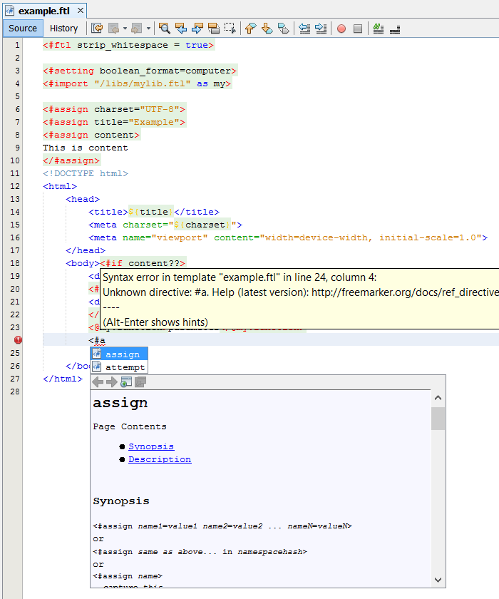

forked from rostanek/freemarker-support-for-netbeans
- dsabled debug output for performance reasons
- added FreeMarker jar
- HTML, FTL completion https://blogs.oracle.com/geertjan/html-embedding-for-freemarker

# freemarker-support-for-netbeans
FreeMarker (2.3.23) support for NetBeans IDE including:
- syntax coloring
- parsing with error highlighting
- tags matching
- occurences marking
- configuration of embedded language (default is HTML)
- code completion of: directives, built-ins, variables, ftl-tag parameters, setting-tag names
- documentation of directives and built-ins above code completion

